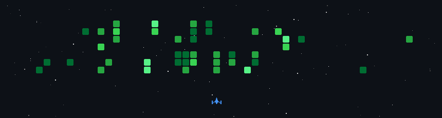

<h1 align="center">Hello, I am Salt.🧂 Welcome to my GitHub page! 👋</h1>

  

### 🧂 About Me

- 🌐 My Blog [HeyMrSalt.github.io](https://heymrsalt.github.io/)
- 🔼 Working on **Cybersecurity Engineer** at [Delta Electronics](https://www.deltaww.com/zh-TW/index)
- 🎓 Graduated with a Master's Degree in **Cybersecurity** from [National Taipei University of Technology](https://www.ntut.edu.tw/)
- 🔬 My Lab on [NTUT is1ab](https://is1ab.com/) and [My Personal Website (Lab)](https://is1ab.com/#/Member/2023/Salt)
- ⛳ My CTF Challenges on [My-CTF-Challenges](https://github.com/HeyMrSalt/My-CTF-Challenges)
- 🌱 Learning **Crypto**, **OID4VC**, **Pentest**, **TARA**, **UDS**, **CAN bus**, **Fuzz Testing** and **ISO-21434**
- 🔍 [Keywords for Paper](https://hdl.handle.net/11296/apugcf) Research on **LEO satellite communication**, **Authentication**, **Key agreement** and **PQC**
- ♉ TL;DR about Me [HERE](https://heymrsalt.github.io/about)
<!--
- 💼 Working on [Turing Space](https://turingcerts.com)
-->

<!--
**HeyMrSalt/HeyMrSalt** is a ✨ _special_ ✨ repository because its `README.md` (this file) appears on your GitHub profile.

Here are some ideas to get you started:

- 🎓 NTUT is1ab [My-Lab-Personal-Website](https://is1ab.com/#/Member/2023/Salt)
- 💼 Working on ...
- 🌱 Learning **Crypto**
- ⛳ My CTF Challenges on : [/My-CTF-Challenges](https://) 
- 🚩 Some CTF writeups on : [https://](https://)
- 🔍 Research of paper : [/Paper reading](https://)
- 📫 How to reach me : **@gmail.com**

- 🔭 I’m currently working on ...
- 🌱 I’m currently learning ...
- 👯 I’m looking to collaborate on ...
- 🤔 I’m looking for help with ...
- 💬 Ask me about ...
- 📫 How to reach me: ...
- 😄 Pronouns: ...
- ⚡ Fun fact: ...
-->

---

### 🐈‍⬛ My GitHub Stats

<!--
小蜜蜂
-->

<!--
貪吃蛇
-->
<!--

-->
<!--
敲磚塊 breakout
-->
<!--
<picture>
  <source
    media="(prefers-color-scheme: dark)"
    srcset="https://raw.githubusercontent.com/HeyMrSalt/HeyMrSalt/output/breakout-dark.svg"
  />
  <source
    media="(prefers-color-scheme: light)"
    srcset="https://raw.githubusercontent.com/HeyMrSalt/HeyMrSalt/output/breakout-light.svg"
  />
  
</picture>
-->

<!--
  
-->

  

---

### 📅 My Recent Itinerary

 

| Date               | Type     | Event                                        | Role       |
| ------------------ | -------- | -------------------------------------------- | ---------- |
| 2026.08.21-08.22   | 參與     | HITCON 2026                                   | 會眾 |
| 2026.05.05-05.07   | 參與     | 臺灣資安大會 CyberSec 2026                      | 會眾 |
| 2026.04.25-04.27   | 參與     | 10th CSP 2026                                 | 會眾 | 
| 2025.09.15-09.21   | 競賽     | is1abCTF 2025                                 | 出題 |
| 2025.08.15-08.16   | 參與     | HITCON CMT 2025                               | 會眾 |
| 2025.07.01-09.11   | 錄取     | 114 年度教育體系資安攻防演練                      | 攻擊手 |
| 2025.05.24-05.26   | 競賽     | AIS3 Pre-exam 2025                            | 參賽 |
| 2025.04.15-04.17   | 參與     | 臺灣資安大會 CyberSec 2025                      | 會眾 |
| 2025.04.15         | 競賽     | CyberSec CyberRange 2025 初賽 Day1            | 參賽 |
| 2025.04.12-04.14   | 競賽     | DEFCON CTF Qual 2025                         | 參賽 |
| 2025.03.08-03.18   | 競賽     | picoCTF 2025                                 | 參賽 |
| 2025.02.07-02.08   | 競賽     | AIS3 EOF CTF 2025 Final                      | 參賽 |
| 2024.12.13-12.15   | 競賽     | HTB University CTF 2024                      | 參賽 |
| 2024.11.23         | 參與     | CTF 種子培訓工作坊-台北                         | 會眾 |
| 2024.11.06         | 參與     | 工研院後量子課程-高階導論                        | 會眾 |
| 2024.11.02         | 競賽     | 2024 CGGC 網路守護者挑戰賽                      | 參賽 |
| 2024.10.30         | 參與     | HITCON-ENTERPTRISE 2024                      | 會眾 |
| 2024.10.30         | 參與     | 後量子創新應用推廣說明會                         | 會眾 |
| 2024.10.21-10.26   | 競賽     | Hack-The-Boo 2024                            | 參賽 |
| 2024.10.14         | 參與     | 後量子密碼偵測與遷移工作坊                       | 會眾 |
| 2024.10.12         | 競賽     | 113年度 資安技能金盾獎競賽-初賽                  | 參賽 |
| 2024.09.25         | 參與     | 工研院後量子課程 中階導論                        | 會眾 |
| 2024.09.14         | 競賽     | 2024 神盾盃資安競賽 預賽                        | 參賽 |
| 2024.09.02-09.09   | 競賽     | is1abCTF 2024                                 | 出題 |
| 2024.08.29-08.30   | 擔任     | 第三十四屆全國資安會議 CISE 2024                | 工作人員 |
| 2024.08.26-08.28   | 參與     | NISRA Enlightened 2024                       | 學員 |
| 2024.08.23-08.24   | 參與     | HITCON CMT 2024                              | 會眾 |
| 2024.07.28-08.04   | 錄取     | AIS3 2024 新型態暑期課程                        | 學員 |
| 2024.07.26         | 參與     | 工研院後量子課程-初階導論                         | 會眾 |

---

### 🎯 Goals for 2026

- 💼 Find a fulfilling job in the cybersecurity field
- 🛠️ Create and contribute to useful open-source tools
- 📝 Publish at least 10 articles on my blog with positive feedback
- 💪 Maintain a consistent exercise routine

---

### 🎧 My Current Favorite Music

<!--
maxresdefault.jpg	1920x1080 (最高)	  僅在影片上傳者提供高於 1280x720 的自訂縮圖時才會存在。如果影片較舊或未提供高解析度縮圖，就會破圖。
sddefault.jpg	    640x480 (標準)	高	標準解析度縮圖，大多數影片都有。
hqdefault.jpg	    480x360 (高品質)	  高品質縮圖，幾乎所有影片都會生成，是很安全的選擇。
mqdefault.jpg	    320x180 (中等)	    中等品質縮圖。
default.jpg	      120x90 (最低)	    最低品質縮圖，保證 100% 存在，但畫質很差。
-->

---

Hey there! Great to meet U. I've been mapping out my cybersecurity journey. Let's convo it up 😄\
--- Edited by Salt in 20260303         

 
